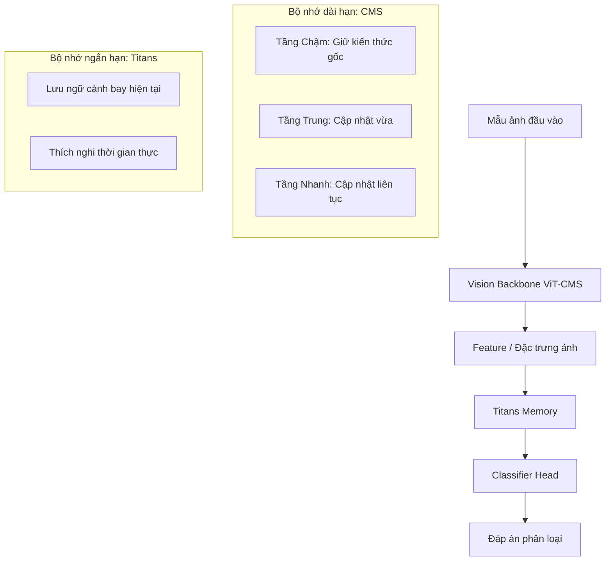
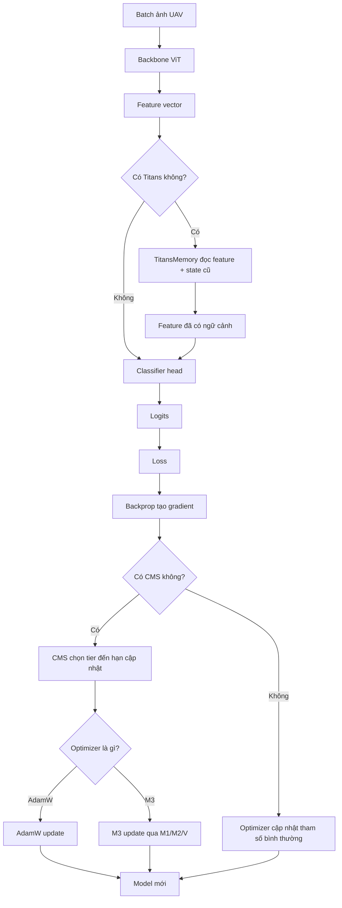

# Sổ tay Thuật ngữ AI dễ hiểu: Từ Cơ bản đến Nâng cao (Titans / CMS / HOPE)

Tài liệu này được viết dành riêng cho người mới bắt đầu tiếp cận trí tuệ nhân tạo (AI). Chúng ta sẽ dùng các hình ảnh ẩn dụ thực tế để giải thích các thuật ngữ học thuật phức tạp trong dự án.

---

## 🟥 PHẦN 1: Các Khái niệm AI Cơ bản & Cấu trúc Mô hình

Trước khi đi vào các bộ nhớ phức tạp, hãy hình dung cách một mô hình AI hoạt động giống như một **học sinh học tập và đi thi**:

| Thuật ngữ gốc | Giải thích đơn giản | Ẩn dụ thực tế |
| :--- | :--- | :--- |
| **Model** (Mô hình AI) | Là "bộ não nhân tạo" chứa các công thức toán học, sau khi học xong sẽ có khả năng nhận diện hình ảnh. | Một học sinh trước và sau khi học bài. |
| **Training** (Huấn luyện) | Quá trình cho AI xem hàng ngàn bức ảnh kèm đáp án đúng để nó tự rút ra quy luật. | Quá trình học sinh ôn tập các đề bài có sẵn lời giải. |
| **Testing / Evaluation** (Đánh giá) | Kiểm tra xem sau khi học, AI tự giải quyết các bức ảnh mới (không có đáp án) đúng được bao nhiêu %. | Buổi thi cử chính thức để lấy điểm số thực tế. |
| **Parameter / Weight** (Trọng số) | Các liên kết nơ-ron bên trong bộ não AI. Khi học, các trọng số này sẽ thay đổi để lưu giữ kiến thức. | Các liên kết dây thần kinh trong não người sẽ dày lên khi ta rèn luyện một kỹ năng nào đó. |
| **Loss** (Hàm mất mát / Lỗi) | Điểm số đo lường mức độ dự đoán sai của AI. Mục tiêu của huấn luyện là kéo Loss về càng thấp càng tốt. | Số lỗi sai trong bài kiểm tra nháp của học sinh. |
| **Gradient** (Độ dốc) | Hướng chỉ đường cho thấy cần tăng hay giảm các Trọng số bao nhiêu để giảm bớt lỗi sai (Loss). | Lời khuyên của giáo viên: *"Em cần tập trung học kỹ phần hình học hơn phần đại số để tăng điểm."* |
| **Backpropagation** (Lan truyền ngược) | Quá trình đi ngược từ kết quả lỗi sai (Loss) để tính toán Gradient cho từng nơ-ron từ cuối lên đầu. | Học sinh xem đáp án bài thi thử, dò lại từng bước làm của mình để xem mình đã tư duy sai ở bước nào. |
| **Optimizer** (Bộ tối ưu hóa) | Thuật toán hướng dẫn mô hình cách sửa đổi các "trọng số" dựa trên Gradient sao cho học nhanh nhất. | Phương pháp học tập (học vẹt, học hiểu bản chất, hay sơ đồ tư duy) giúp học sinh tiến bộ nhanh nhất. |
| **Backbone** (Xương sống / Bộ trích xuất đặc trưng) | Phần đầu tiên của mô hình AI, có nhiệm vụ nhìn vào bức ảnh và chuyển đổi nó thành một chuỗi các con số đại diện (gọi là vector đặc trưng). | **Đôi mắt** của học sinh: Nhìn ảnh để nhận diện màu sắc, hình dáng cơ bản (đường cong, góc cảnh) nhưng chưa gọi tên cụ thể. |
| **Classifier / Head** (Đầu phân loại) | Phần cuối cùng của mô hình AI, lấy thông tin từ "Backbone" để đưa ra kết luận cuối cùng. | **Cửa miệng** của học sinh: Dựa trên những gì mắt thấy, phát ngôn ra đáp án: *"Đây là sân bay!"* |
| **Fine-tuning** (Tinh chỉnh) | Quá trình lấy một bộ não AI đã thông minh sẵn (đã được học trên hàng triệu ảnh mạng) và huấn luyện thêm một chút trên dữ liệu chuyên biệt của mình. | Một bác sĩ đa khoa tham gia khóa học ngắn hạn để chuyên về phẫu thuật thẩm mỹ. |

### Các thành phần bên trong Vision Transformer (ViT - Mô hình thị giác chính của dự án)
*   **ViT (Vision Transformer):** Một loại kiến trúc mô hình học sâu hiện đại xử lý ảnh bằng cách chia nhỏ ảnh thành các mảnh ghép và học mối quan hệ giữa chúng, tương tự như cách xử lý các từ trong một câu văn.
*   **Patch (Mảnh ảnh):** ViT chia một bức ảnh thành các ô vuông nhỏ (ví dụ: $16 \times 16$ pixel). Mỗi ô vuông này gọi là một Patch. Nó giống như một mảnh ghép của bức tranh xếp hình.
*   **Token:** Đại diện kỹ thuật số của một Patch sau khi được mã hóa thành một chuỗi số.
*   **Attention Mechanism (Cơ chế chú ý):** Giúp AI khi nhìn vào một mảnh ảnh (Token) có thể biết được nó cần liên kết và "chú ý" vào các mảnh ảnh nào khác để hiểu toàn bộ bối cảnh (ví dụ: chú ý vào đường băng khi muốn phân loại sân bay).
*   **MLP (Multi-Layer Perceptron):** Các lớp kết nối nơ-ron dày đặc đứng sau cơ chế Attention trong ViT. Trong dự án của chúng ta, **MLP đóng vai trò là "kho chứa kiến thức dài hạn"** của mô hình và là đối tượng chính bị can thiệp bởi CMS.

---

## 🟨 PHẦN 2: Học Liên Tục (Continual Learning) & Thử Nghiệm

UAV bay trên bầu trời gặp các địa hình mới nối tiếp nhau theo thời gian thực và cần phải **vừa bay vừa học thêm**.

*   **Catastrophic Forgetting (Quên thảm họa):** Khi dạy AI nhận diện địa hình mới (ví dụ: Sa mạc), bộ não AI tự động ghi đè trọng số mới lên trọng số cũ, làm biến mất hoàn toàn khả năng nhận diện địa hình cũ (Rừng, Sông). Giống như việc học tiếng Pháp xong chuyển sang học tiếng Tây Ban Nha thì não xóa sạch tiếng Pháp.
*   **Class-Incremental Learning (Học tăng dần lớp):** Học thêm từng lớp địa hình mới theo lộ trình thời gian (Task 0: `Sông/Rừng` ➔ Task 1: `Sân bay` ➔ Task 2: `Biển`...).
*   **Ablation Study (Nghiên cứu bóc tách / Loại trừ):** Phương pháp thí nghiệm bằng cách tắt bớt một bộ phận nào đó của mô hình để xem hiệu năng giảm thế nào, từ đó chứng minh bộ phận đó thực sự hữu ích. (Ví dụ: Thử nghiệm tắt Titans chỉ bật CMS, hoặc ngược lại, để chứng minh kiến trúc HOPE đầy đủ tốt hơn).
*   **Domain Shift (Lệch miền dữ liệu):** Hiện tượng dữ liệu thực tế bị thay đổi bối cảnh so với lúc học (ví dụ: AI học ảnh chụp ban ngày nhưng khi kiểm tra lại bay vào ban đêm, hoặc thời tiết sương mù, mây che phủ). Mô hình AI tốt phải chống chịu được hiện tượng này (gọi là **Robustness**).

---

## 🟩 PHẦN 3: 5 Phương Pháp Chống Quên Cổ Điển (Baselines)

| Thuật ngữ | Giải thích cơ chế | Ẩn dụ thực tế |
| :--- | :--- | :--- |
| **Naive Fine-tune** | Học cái mới bình thường, kệ cái cũ. | Học vẹt bài mới, quên sạch bài cũ. |
| **EWC** | Phạt mô hình nếu thay đổi các nơ-ron quan trọng của nhiệm vụ cũ. | Đổ keo silicon cố định nếp nhăn não cũ quan trọng. |
| **Replay Buffer** | Lưu một chiếc hộp ảnh cũ nhỏ để thỉnh thoảng lấy ra huấn luyện chung với ảnh mới. | Thỉnh thoảng lôi đề thi cũ ra giải lại cho đỡ quên. |
| **LwF** | Dùng phiên bản đóng băng của chính mình trong quá khứ để giám sát và phạt nếu học sinh làm sai lệch hành vi cũ. | Học bài mới dưới sự kèm cặp của bản thân mình ngày hôm qua. |
| **NCM** | Không dùng gradient để cập nhật trọng số. Chỉ lưu trữ một "đặc trưng trung bình đại diện" (Prototype) cho mỗi lớp. | Chụp một tấm ảnh đại diện trung bình cho mỗi lớp và so sánh độ tương đồng (Cosine Score) khi gặp ảnh mới. Tuyệt đối không quên. |

---

## 🟦 PHẦN 4: Trọng tâm Đề tài (Nested Learning, Titans, CMS, HOPE)



*   **Nested Learning (Học lồng nhau / Đa cấp độ):** Thiết kế bộ nhớ AI chia thành nhiều tầng lưu trữ có tốc độ truy xuất khác nhau (như **RAM** nhanh nhưng ngắn hạn và **Ổ cứng** chậm nhưng lưu trữ lâu dài).
*   **Titans (Bộ nhớ nơ-ron tuần tự phục hồi):** Đóng vai trò bộ nhớ ngắn hạn. Nhận diện ngữ cảnh chuỗi ảnh bay liên tục để thích nghi tức thì với thời tiết/ánh sáng mới mà không cần huấn luyện lại.
*   **Truncated BPTT (Backpropagation Through Time cắt ngắn):** Khi bộ nhớ Titans ghi nhớ một chuỗi quá dài qua nhiều Task, việc tính toán lỗi ngược dòng thời gian sẽ tiêu tốn cực kỳ nhiều RAM của máy tính. Ta phải "cắt ngắn" lịch sử tính toán lại sau một số bước nhất định để tránh nổ bộ nhớ card đồ họa (gọi là lỗi **OOM - Out of Memory**).
*   **CMS (Continuum Memory System - Bộ nhớ đa tần số):** Bộ nhớ dài hạn nằm trong ViT. Chia nơ-ron MLP thành 3 nhóm: Nhóm nhanh (học chi tiết mới từng bước), Nhóm trung bình (cập nhật vừa phải), Nhóm chậm (lâu lâu mới cập nhật để giữ kiến thức nền tảng).
*   **HOPE:** Sự kết hợp hoàn hảo của **Titans** (bộ nhớ ngắn hạn nằm ở lớp trên cùng) và **CMS** (bộ nhớ dài hạn nằm ở backbone bên dưới).
*   **M3 Optimizer / Delta-Momentum:** Thuật toán tối ưu hóa đặc biệt giúp điều phối dòng gradient cập nhật nhịp nhàng giữa các tầng tần số khác nhau của CMS và Titans để tránh mô hình bị xung đột toán học sinh ra lỗi số vô hạn (**NaN - Not a Number** - lỗi chia cho 0 hoặc tràn số làm hỏng quá trình huấn luyện).

---

## 🟪 PHẦN 5: Các chỉ số đo lường (Metrics)

*   **Average Accuracy ($A_{avg}$):** Điểm số trung bình cuối cùng trên tất cả các tác vụ đã học.
*   **Backward Transfer (BWT) / Forgetting ($F_{avg}$):** Đo lường mức độ suy giảm điểm số của các môn học cũ sau khi học xong môn học mới.
*   **Forward Transfer (FWT):** Khả năng học một kỹ năng mới dễ dàng hơn nhờ kinh nghiệm tích lũy trước đó (nhờ bộ nhớ Titans truyền tiếp).
*   **Open-set Detection (Nhận diện lớp lạ):** Khả năng AI biết từ chối đoán bừa khi thấy vật thể lạ chưa từng học.
    *   *AUC:* Điểm phân biệt quen/lạ tổng thể (1.0 là hoàn hảo).
    *   *EER (Equal Error Rate):* Điểm cân bằng lỗi nhận nhầm (càng thấp càng tốt).

---

## ⬛ PHẦN 6: Kỹ thuật phần cứng & Tính tái lập

*   **AMP (Automatic Mixed Precision):** Kỹ thuật tự động trộn lẫn các định dạng số thực. Thay vì dùng số thực 32-bit (`fp32`) nặng nề cho toàn mạng, AMP tự động chuyển sang số thực 16-bit (`fp16` hoặc `bf16`) ở những chỗ thích hợp giúp card đồ họa (GPU) chạy nhanh gấp đôi và tiết kiệm một nửa bộ nhớ.
*   **Seed (Hạt giống ngẫu nhiên):** Việc huấn luyện AI có rất nhiều yếu tố ngẫu nhiên (như khởi tạo trọng số, trộn ảnh). Cố định **Seed** (ví dụ: `seed: 0`) giúp đảm bảo mỗi lần chạy code, máy tính đều cho ra kết quả giống hệt nhau (gọi là **Tính tái lập - Reproducibility**).

---

## 🧭 PHẦN 7: Phân biệt Titans, CMS, M3, AdamW, HOPE trong project này

Phần này là bản đồ tư duy quan trọng nhất của đồ án. Lý do dễ bị rối là vì **Titans, CMS và M3 đều có chữ "memory"**, nhưng chúng không phải cùng một thứ. Chúng nằm ở **ba vị trí khác nhau** trong hệ thống:

| Thành phần | Nằm ở đâu? | Nó nhớ cái gì? | Tầng thời gian | Vai trò thật sự |
| :--- | :--- | :--- | :--- | :--- |
| **Backbone / ViT** | Trong model | Kiến thức thị giác tổng quát đã học từ pretrained | Rất dài hạn | Nhìn ảnh và trích xuất feature |
| **CMS** | Bọc quanh việc cập nhật backbone/head | Trọng số model nên đổi nhanh/chậm thế nào | Dài hạn, nhiều nhịp | Cho model học cái mới mà không làm trôi sạch kiến thức cũ |
| **Titans** | Sau backbone, trước classifier head | Ngữ cảnh của chuỗi ảnh đang bay qua | Ngắn hạn / nhanh nhất | Giúp model thích nghi với stream hiện tại, ví dụ cảnh, ánh sáng, miền dữ liệu đang thay đổi |
| **AdamW** | Optimizer | Momentum gradient kiểu chuẩn | Bộ nhớ tối ưu hóa đơn tầng | Cách cập nhật trọng số mạnh, ổn định, phổ biến |
| **M3** | Optimizer thay AdamW | Nhiều tầng momentum/gradient memory | Bộ nhớ tối ưu hóa đa tầng | Cập nhật trọng số theo tinh thần Nested Learning, hợp hơn với CMS/HOPE |
| **HOPE** | Kiến trúc ghép | Dùng cả CMS + Titans | Kết hợp nhanh và chậm | Bản đầy đủ của project: backbone có CMS, phía trên có Titans, optimizer thường dùng M3 |

Nói thật ngắn:

*   **Titans nhớ trạng thái của dữ liệu đang đi qua model.**
*   **CMS điều khiển nhịp thay đổi trọng số của model.**
*   **M3 điều khiển cách optimizer học từ gradient qua nhiều tầng momentum.**
*   **AdamW là optimizer chuẩn để so sánh.**
*   **HOPE là kiến trúc ghép Titans + CMS, thường chạy với M3.**

---

## 🧱 PHẦN 8: Vì sao cái nào cũng có nhiều tầng?

Nested Learning nhìn việc học giống như một hệ thống có nhiều loại trí nhớ:

| Ví dụ con người | Trong AI | Tốc độ đổi | Ý nghĩa |
| :--- | :--- | :--- | :--- |
| Phản xạ tức thì | Titans state | Rất nhanh | Thích nghi với vài ảnh gần đây |
| Ghi chú tạm trong lúc học | Momentum của optimizer | Nhanh / trung bình | Nhớ hướng gradient đang đi |
| Kiến thức vừa học trong tuần | CMS fast/mid tier | Trung bình | Học lớp mới nhưng có kiểm soát |
| Kiến thức nền lâu dài | CMS slow tier + pretrained ViT | Chậm | Giữ kiến thức cũ, chống quên |

Vì vậy, "nhiều tầng" không phải để làm mô hình phức tạp cho vui. Mỗi tầng trả lời một câu hỏi khác nhau:

*   **Tầng nhanh:** gặp dữ liệu mới thì phản ứng nhanh ra sao?
*   **Tầng trung:** nên hấp thụ kiến thức mới đến mức nào?
*   **Tầng chậm:** phần nào phải giữ lại để không quên nhiệm vụ cũ?

Trong continual learning, nếu chỉ có tầng nhanh, model dễ học cái mới nhưng quên cái cũ. Nếu chỉ có tầng chậm, model giữ kiến thức tốt nhưng học cái mới ì ạch. Đồ án của mình thử chứng minh rằng kết hợp nhiều tầng sẽ cân bằng tốt hơn.

---

## 🟦 PHẦN 9: Titans là gì?

**Titans** trong project là một khối bộ nhớ thần kinh đặt **sau backbone ViT**. Backbone biến ảnh thành vector đặc trưng, sau đó Titans đọc các vector này như một chuỗi.

Luồng đơn giản:

```text
Ảnh UAV
  -> ViT backbone
  -> feature vector
  -> TitansMemory
  -> classifier head
  -> dự đoán lớp ảnh
```

Titans không chỉ nhận từng ảnh độc lập. Nó có một biến **state**, hiểu nôm na là "ký ức hiện tại". Khi ảnh mới đi qua, Titans vừa dùng feature hiện tại, vừa dùng state cũ để tạo feature đã được điều chỉnh theo ngữ cảnh.

Ví dụ:

*   Nếu UAV đang bay qua một vùng toàn ảnh biển, Titans có thể giữ ngữ cảnh "đang ở miền biển".
*   Nếu ánh sáng bị đổi do mây, Titans có thể giúp model bớt hoảng vì các ảnh gần nhau đều đang chịu cùng điều kiện.
*   Nếu chuyển task, cách reset state sẽ quyết định Titans có mang ký ức cũ sang task mới hay không.

Trong project có các kiểu reset quan trọng:

| Reset mode | Ý nghĩa | Khi nào dùng |
| :--- | :--- | :--- |
| `image` | Mỗi ảnh reset memory | Đối chứng yếu, gần như không cho Titans nhớ chuỗi |
| `task` | Giữ memory trong một task, sang task mới thì reset | Kiểm tra Titans nhớ trong nội bộ task |
| `never` | Không reset qua task | Kiểm tra ý tưởng mạnh nhất: memory xuyên suốt stream |

Vai trò thật sự của Titans:

*   Không phải optimizer.
*   Không phải CMS.
*   Không trực tiếp chia tham số thành tầng nhanh/chậm.
*   Nó là **bộ nhớ ngữ cảnh ở tầng feature**, giúp mô hình xử lý dữ liệu tuần tự tốt hơn.

---

## 🟩 PHẦN 10: CMS là gì?

**CMS** là cách cập nhật trọng số theo nhiều tần số. Trong project, CMS không cần mổ sâu forward của ViT. Nó chủ yếu hoạt động qua `CMSOptimizer`, tức là một lớp bọc quanh optimizer.

Ý tưởng:

```text
Không CMS:
  batch nào cũng cập nhật gần như toàn bộ tham số

Có CMS:
  nhóm nhanh  -> cập nhật thường xuyên
  nhóm trung  -> cập nhật thưa hơn
  nhóm chậm   -> lâu lâu mới cập nhật
```

Ví dụ với period `p=[1, 8, 64]`:

| Tier | Period | Nghĩa là |
| :--- | :--- | :--- |
| Fast | `1` | Cập nhật mỗi step |
| Mid | `8` | 8 step mới cập nhật một lần |
| Slow | `64` | 64 step mới cập nhật một lần |

Ẩn dụ dễ hiểu:

*   **Fast tier:** ghi nháp, sửa liên tục.
*   **Mid tier:** ghi vào vở sau khi đã chắc hơn.
*   **Slow tier:** ghi vào sách giáo khoa cá nhân, rất ít sửa.

Vai trò thật sự của CMS:

*   CMS là cơ chế **chống quên bằng cách kiểm soát tốc độ đổi trọng số**.
*   CMS mạnh nhất khi backbone được mở băng để fine-tune, vì lúc đó model có thể học thêm nhưng cần tránh trôi quá nhanh.
*   CMS không phải là một model riêng hoàn toàn. Nó là cách "điều tiết nhịp học" cho các nhóm tham số.

Điểm cần nhớ: **CMS là memory dài hạn vì nó tác động lên chính trọng số của model.** Một khi trọng số đã đổi, kiến thức của model cũng đổi.

---

## 🟨 PHẦN 11: AdamW là gì?

**AdamW** là optimizer chuẩn, rất phổ biến trong deep learning. Nó dùng gradient hiện tại và một số thống kê quá khứ để cập nhật trọng số.

Luồng:

```text
loss
  -> gradient
  -> AdamW tính hướng cập nhật
  -> sửa trọng số model
```

AdamW có hai ý chính:

*   **Momentum:** nhớ hướng gradient gần đây để bước đi mượt hơn.
*   **Adaptive learning rate:** tham số nào gradient dao động mạnh thì bước cẩn thận hơn, tham số nào ổn định thì bước tự tin hơn.
*   **Weight decay tách rời:** giúp trọng số không phình quá mức, thường làm model tổng quát tốt hơn.

Vai trò trong project:

*   AdamW là **baseline optimizer**.
*   Dùng AdamW để trả lời câu hỏi: "Nếu không dùng M3 thì HOPE/CMS có còn tốt không?"
*   Nếu M3 thắng AdamW trong cùng cấu hình, ta có bằng chứng rằng optimizer đa tầng có đóng góp.

AdamW vẫn rất mạnh. Không nên viết trong báo cáo kiểu "AdamW đơn giản nên yếu". Cách nói đúng hơn là: **AdamW là chuẩn mạnh để đối chứng, còn M3 là biến thể theo Nested Learning được kỳ vọng phù hợp hơn với kiến trúc nhiều tầng.**

---

## 🟥 PHẦN 12: M3 là gì?

Trong project, **M3** là optimizer thay cho AdamW. Nếu CMS là nhiều tầng ở **trọng số model**, thì M3 là nhiều tầng ở **optimizer memory**.

M3 giữ các bộ nhớ gradient như:

| Ký hiệu dễ hiểu | Vai trò |
| :--- | :--- |
| `M1` | Momentum nhanh, phản ứng với gradient gần đây |
| `M2` | Momentum chậm hơn, chỉ cập nhật theo tần số |
| `V` | Bộ nhớ độ lớn gradient, giúp chuẩn hóa bước cập nhật |

Luồng:

```text
loss
  -> gradient
  -> M3 cập nhật M1/M2/V
  -> tạo update direction
  -> sửa trọng số model
```

Điểm khác AdamW:

| AdamW | M3 |
| :--- | :--- |
| Một kiểu momentum chính | Nhiều tầng momentum |
| Thiết kế optimizer phổ thông | Thiết kế theo tinh thần Nested Learning |
| Không biết trực tiếp về CMS tier | Có thể phối hợp tốt hơn với update nhiều tần số |
| Ổn định, chuẩn mạnh | Mạnh trong project nhưng cần ghi rõ là bản thực dụng/xấp xỉ |

Lưu ý quan trọng cho báo cáo: bản M3 hiện tại trong code nên gọi là **M3-delta-approx** hoặc **M3 bản thực dụng của project**, không nên gọi là "Delta Momentum đầy đủ 100% theo paper".

Vì sao? Vì bản code đã có các thành phần quan trọng như multi-memory, Newton-Schulz/Muon-style update cho ma trận, kiểm tra NaN/Inf, clipping update norm; nhưng phần Delta Momentum đầy đủ trong paper có thêm cơ chế quên theo hướng/preconditioner phức tạp hơn. Project đang dùng bản ổn định và phù hợp thực nghiệm hơn, không phải bản toán học đầy đủ nhất.

Vai trò thật sự của M3:

*   Không trực tiếp phân loại ảnh.
*   Không tạo feature.
*   Không phải Titans.
*   Nó quyết định **mỗi lần học thì trọng số được sửa như thế nào**.
*   Nó giúp hệ nhiều tầng như CMS/HOPE bớt xung đột và học ổn định hơn.

---

## 🟪 PHẦN 13: HOPE là gì?

**HOPE** trong project là kiến trúc ghép **CMS + Titans**:

```text
Ảnh UAV
  -> ViT backbone được điều khiển bởi CMS
  -> feature
  -> TitansMemory
  -> residual / norm
  -> classifier head
  -> logits
```

Nếu thêm optimizer:

```text
Forward:
  ảnh -> ViT/CMS -> feature -> Titans -> head -> logits -> loss

Backward:
  loss -> gradient
       -> CMS chọn tier nào được phép cập nhật
       -> M3 hoặc AdamW cập nhật trọng số
       -> Titans state được giữ/reset theo cấu hình
```

HOPE trả lời câu hỏi nghiên cứu chính:

> Nếu ta có một tầng nhớ nhanh ở feature level (Titans) và một tầng nhớ chậm/dài hạn ở weight level (CMS), liệu chúng có bổ sung cho nhau trong continual learning không?

Vai trò từng phần trong HOPE:

| Thành phần | Trong HOPE làm gì? |
| :--- | :--- |
| ViT backbone | Nhìn ảnh, tạo feature thị giác |
| CMS | Kiểm soát backbone/head học nhanh hay chậm |
| Titans | Giữ ngữ cảnh stream hiện tại |
| Head | Chuyển feature sau Titans thành class logits |
| M3 | Cập nhật trọng số theo optimizer nhiều tầng |
| AdamW | Đối chứng optimizer chuẩn |

Điểm căng nhất của HOPE là **feature drift**. Vì CMS cho phép backbone thay đổi, không gian feature đầu vào của Titans cũng thay đổi. Nếu feature trôi quá mạnh, ký ức cũ trong Titans có thể trở nên lệch. Vì vậy project có log kiểu `norm(state)` của Titans và `delta_w` theo tier CMS để xem hệ có ổn định không.

---

## 🔁 PHẦN 14: Luồng hoạt động chi tiết trong project

### 14.1. Luồng train một batch



### 14.2. Luồng học liên tục qua nhiều task

```text
Task 0: học một nhóm lớp đầu tiên
  -> train trên task 0
  -> evaluate task 0

Task 1: học nhóm lớp mới
  -> train trên task 1
  -> evaluate lại task 0 và task 1
  -> nếu task 0 tụt mạnh: có forgetting

Task 2:
  -> train trên task 2
  -> evaluate task 0, task 1, task 2

...

Cuối cùng:
  -> tạo acc_matrix.csv
  -> tính Average Accuracy
  -> tính Forgetting / BWT / FWT
```

Ma trận kết quả thường có dạng:

```text
          test task 0   test task 1   test task 2
after T0      0.80           -             -
after T1      0.62          0.75           -
after T2      0.55          0.68          0.77
```

Cách đọc:

*   Hàng ngang là sau khi học xong task nào.
*   Cột dọc là điểm trên từng task kiểm tra.
*   Nếu cột task cũ giảm dần khi xuống các hàng sau, đó là forgetting.
*   Điểm cuối cùng trên hàng cuối cho biết model sau khi học toàn bộ stream còn nhớ được gì.

---

## 🧪 PHẦN 15: Cách phân biệt các thí nghiệm G1, G2, G3, G4

| Giai đoạn | Chạy cái gì? | Mục tiêu |
| :--- | :--- | :--- |
| **G1 Baselines** | Fine-tune, EWC, Replay, LwF, NCM | Có mốc so sánh cổ điển |
| **G2 Titans** | Frozen ViT + Titans + head | Kiểm tra memory nhanh/xuyên task |
| **G3 CMS** | ViT mở băng + CMS | Kiểm tra update đa tần số chống quên |
| **G4 HOPE** | ViT + CMS + Titans, thường với M3 | Kiểm tra kết hợp nhanh + chậm |
| **G5 Đánh giá** | Tổng hợp nhiều seed/dataset/ablation | Kết luận cái gì thật sự giúp |

Các câu hỏi nghiên cứu tương ứng:

*   **G1:** Nếu dùng phương pháp cổ điển thì kết quả tới đâu?
*   **G2:** Titans có giúp nhớ/thích nghi theo stream không?
*   **G3:** CMS có giảm quên hơn fine-tune thường không?
*   **G4:** Titans + CMS có tốt hơn từng phần riêng lẻ không?
*   **G5:** Kết quả có ổn định qua seed/dataset không?

---

## 🧩 PHẦN 16: Bảng phân biệt cực ngắn để khỏi nhầm

| Câu hỏi | Câu trả lời |
| :--- | :--- |
| Cái nào là kiến trúc model? | ViT, TitansClassifier, HOPEClassifier |
| Cái nào là memory nằm trong forward? | Titans |
| Cái nào là memory nằm trong cách update trọng số? | CMS |
| Cái nào là optimizer? | AdamW, M3 |
| Cái nào là baseline? | Fine-tune, EWC, Replay, LwF, NCM, AdamW trong vài thí nghiệm |
| Cái nào là phương pháp đầy đủ của đồ án? | HOPE + CMS + Titans + thường dùng M3 |
| Cái nào chống quên trực tiếp nhất? | CMS, Replay, EWC, NCM |
| Cái nào giúp thích nghi stream nhất? | Titans |
| Cái nào chứng minh ý tưởng Nested Learning rõ nhất? | CMS + M3 + HOPE |

Một câu tóm tắt để nhớ:

> **Titans nhớ ngữ cảnh ảnh đang bay qua; CMS giữ trọng số học theo nhiều nhịp; M3 là optimizer nhiều tầng; AdamW là đối chứng chuẩn; HOPE là bản ghép Titans + CMS để hiện thực hóa Nested Learning trong bài toán UAV continual learning.**
